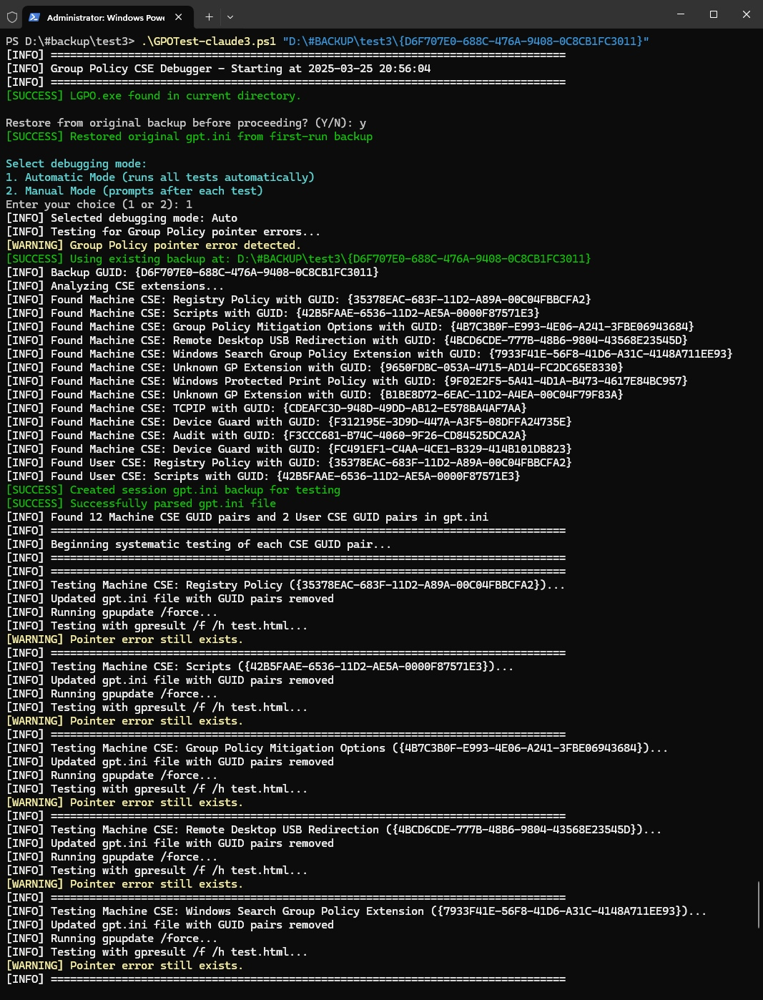
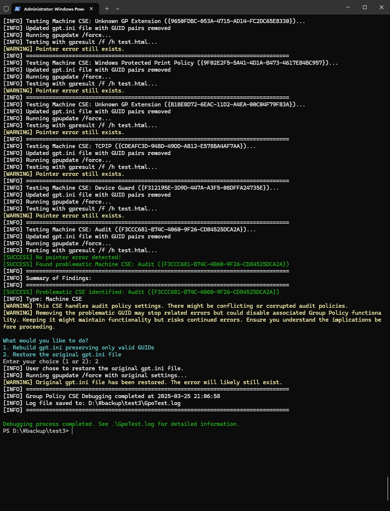

Based on the updated `GPCseDebugger.ps1` file, here's the revised `README.md` content:

```markdown
# Group Policy CSE Debugger

## Description
This tool automates the diagnosis of Microsoft Windows Group Policy errors by identifying problematic Client-Side Extensions (CSEs) that cause "Invalid pointer" and other errors. It systematically tests by removing CSE GUIDs from gpt.ini one by one until the error disappears, identifying the problematic extension. Additionally, it allows users to disable extensions one by one until their problem goes away and enables advanced GPO logging for detailed troubleshooting.

## Requirements
- Windows system with Group Policy functionality
- Administrator privileges

## Installation
1. Download LGPO.exe from the Microsoft Security Compliance Toolkit
2. Place LGPO.exe in the same directory as the script
3. Run the script with administrator privileges

## Usage
```powershell
.\GPCseDebugger.ps1 [-Mode <Auto|Manual>] [-EnableLogging] [-DisableLogging]
```

### Parameters
- **Mode**: (Optional) Debugging mode - "Auto" or "Manual". Default is Auto.
  - **Auto**: Script runs all tests automatically and stops when it finds a problematic CSE
  - **Manual**: Script prompts after each test, allowing user the time to test if a group policy error has been resolved after disabling a CSE
- **EnableLogging**: (Optional) Enables enhanced Group Policy logging for detailed troubleshooting.
- **DisableLogging**: (Optional) Disables enhanced Group Policy logging and removes related files.

### Examples
```powershell
# Run with default settings
.\GPCseDebugger.ps1

# Run in Manual mode
.\GPCseDebugger.ps1 -Mode "Manual"

# Run with enhanced Group Policy logging enabled
.\GPCseDebugger.ps1 -EnableLogging
```

## How It Works
1. Creates or uses a specified Group Policy backup
2. Analyzes CSE extensions
3. Creates first run permanent backup of original \windows\system32\GroupPolicy\gpt.ini to .\GPT_Backups\
4. Systematically removes each CSE GUID pair from \windows\system32\GroupPolicy\gpt.ini
5. Tests after each removal to determine which CSE is causing the error
6. Provides specific advice based on the problematic CSE detected
7. Offers options to rebuild gpt.ini without the problematic CSE or restore original settings (read disclaimer below)

## Log Files
The script maintains a detailed log file (GpoTest.log) that records all actions and findings. Each new session is appended to this log with a timestamp.

## Screenshots



# DISCLAIMER: 

This tool is for diagnostic and debugging purposes to isolate the source of Group Policy errors. Removing problematic CSEs resolves pointer errors but disables related Group Policy functionality. This tool requires elevation/admin rights. 

Resources for additional troubleshooting:
- https://learn.microsoft.com/en-us/archive/blogs/askds/a-treatise-on-group-policy-troubleshootingnow-with-gpsvc-log-analysis
- https://learn.microsoft.com/en-us/answers/questions/120736/gpos-not-applied-ad-group-issue.html
- http://www.sysprosoft.com/policyreporter.shtml
```

You can update your `README.md` file with this content to reflect the recent changes and new command-line parameters.
